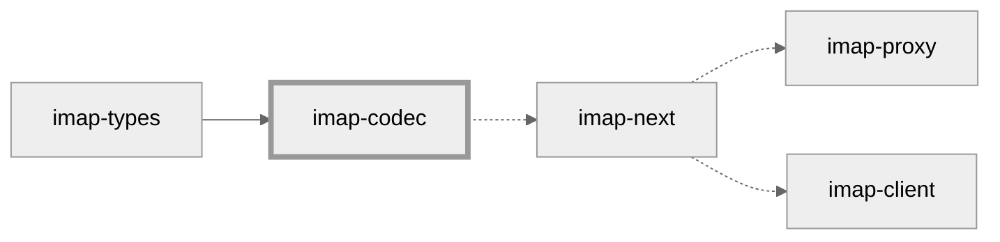

# imap-codec



This library provides parsing and serialization for [IMAP4rev1].
It is based on [`imap-types`] and a [rock-solid] and [well-documented] building block for IMAP client and server implementations in Rust.
The complete [formal syntax] of IMAP4rev1 and several IMAP [extensions] are implemented.

If you are looking for thin protocol handling, i.e., LITERAL handling, AUTHENTICATE, and IDLE, head over to [`imap-next`].

## Features

* Parsing works in streaming mode. `Incomplete` is returned when there is insufficient data to make a final decision. No message will be truncated.
* Parsing is zero-copy by default. Allocation is avoided during parsing, but all messages can explicitly be converted into more flexible owned variants.
* Fuzzing and property-based tests exercise the library. The library is fuzz-tested never to produce a message it can't parse itself.

## Usage

```rust
use imap_codec::{decode::Decoder, encode::Encoder, CommandCodec};

fn main() {
    let input = b"ABCD UID FETCH 1,2:* (BODY.PEEK[1.2.3.4.MIME]<42.1337>)\r\n";

    let codec = CommandCodec::new();
    let (remainder, command) = codec.decode(input).unwrap();
    println!("# Parsed\n\n{:#?}\n\n", command);

    let buffer = codec.encode(&command).dump();

    // Note: IMAP4rev1 may produce messages that are not valid UTF-8.
    println!("# Serialized\n\n{:?}", std::str::from_utf8(&buffer));
}
```

# License

This crate is dual-licensed under Apache 2.0 and MIT terms.

[IMAP4rev1]: https://tools.ietf.org/html/rfc3501
[`imap-types`]: https://docs.rs/imap-types/latest/imap_types/
[`imap-next`]: https://github.com/duesee/imap-next
[rock-solid]: https://github.com/duesee/imap-codec/tree/main/imap-codec/fuzz
[well-documented]: https://docs.rs/imap-codec/latest/imap_codec/
[formal syntax]: https://tools.ietf.org/html/rfc3501#section-9
[extensions]: https://docs.rs/imap-codec/latest/imap_codec/#features
