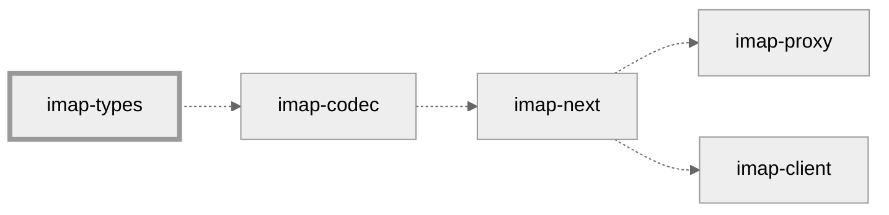

# imap-types



This crate provides a complete set of well-designed, misuse-resistant types for the [IMAP4rev1] protocol and various [extensions].
Notably, it does *not* provide parsers, nor serializers, but tries to become the "standard library" for IMAP in Rust that is
useful for a broad range of crates.

If you are looking for parsers, and serializers, head over to [`imap-codec`].

## Features

* Rust's type system is used to enforce correctness and to make the library misuse-resistant.
  It's not possible to construct a message that violates the IMAP specification.
* Fuzzing (via [cargo fuzz]) and property-based tests are used to uncover bugs.
  The library is fuzz-tested never to produce an invalid message.

## Working with imap-types

To ensure correctness, imap-types makes use of types such as
[`AString`](core::AString),
[`Atom`](core::Atom),
[`IString`](core::IString),
[`Quoted`](core::Quoted), and
[`Literal`](core::Literal).
When constructing messages, imap-types can automatically choose the best representation.
However, it's always possible to manually choose a specific representation.

### Examples

<details>
<summary>Automatic Construction</summary>

This ...

```rust
use imap_types::command::{Command, CommandBody};

let cmd = Command::new(
    "A1",
    CommandBody::login("alice", "password").unwrap()
).unwrap();
```

... will produce ...

```imap
A1 LOGIN alice password
```

However, ...

```rust
use imap_types::command::{Command, CommandBody};

let cmd = Command::new(
    "A1",
    CommandBody::login("alice\"", b"\xCA\xFE".as_ref()).unwrap(),
).unwrap();
```

... will produce ...

```imap
A1 LOGIN "alice\"" {2}
\xCA\xFE
```

Also, the construction ...

```rust,should_panic
use imap_types::command::{Command, CommandBody};

let cmd = Command::new(
    "A1",
    CommandBody::login("alice\x00", "password").unwrap(),
).unwrap();
```

... will fail because IMAP doesn't allow NULL bytes in the username (nor password).
</details>

<details>
<summary>Manual Construction</summary>

You can also use ...

```rust
use imap_types::{
    command::{Command, CommandBody},
    core::Literal,
};

let cmd = Command::new(
    "A1",
    CommandBody::login(Literal::try_from("alice").unwrap(), "password").unwrap(),
).unwrap();
```

... to produce ...

```imap
A1 LOGIN {5}
alice password
```

... even though "alice" could be encoded more simply with an atom or quoted string.

Also, you can use Rust literals and resort to `unvalidated` constructors when you are certain that your input is correct:

```rust
use imap_types::{
    command::{Command, CommandBody},
    core::{AString, Atom, Tag},
    secret::Secret,
};

// This could be provided by the email application.
struct TagGenerator;

impl TagGenerator {
    fn random() -> Tag<'static> {
        // Make this random :-)
        Tag::unvalidated("A1")
    }
}

let tag = TagGenerator::random();

let cmd = Command {
    tag,
    body: CommandBody::Login {
        username: AString::from(Atom::unvalidated("alice")),
        password: Secret::new(AString::from(Atom::unvalidated("password"))),
    },
};
```

In this case, imap-codec won't stand in your way.
However, it won't guarantee that you produce correct messages, either.
</details>

# License

This crate is dual-licensed under Apache 2.0 and MIT terms.

[IMAP4rev1]: https://datatracker.ietf.org/doc/html/rfc3501
[extensions]: https://docs.rs/imap-codec/latest/imap_codec/#features
[`imap-codec`]: https://docs.rs/imap-types/latest/imap_codec/
[cargo fuzz]: https://github.com/rust-fuzz/cargo-fuzz
[core]: https://docs.rs/imap-types/latest/imap_types/core/index.html

